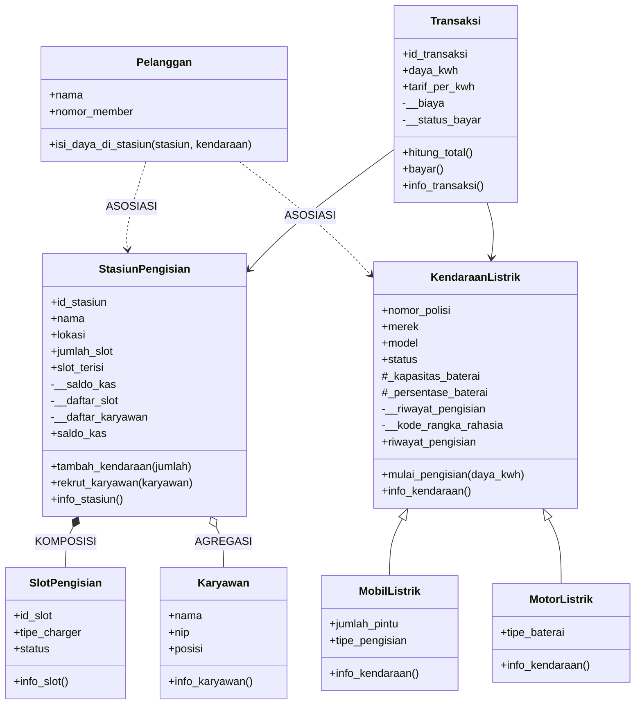

<!-- SISTEM MANAJEMEN STASIUN PENGISIAN KENDARAAN LISTRIK (EV) -->

program ini adalah simulasi sederhana sistem manajemen stasiun pengisian kendaraan listrik yang dibuat dengan PYTHON. program menDEMONSTRASIkan konsep *inheritance*, *encapsulation*, *polymorphism*, serta relasi antar-class pada UML: **KOMPOSISI, AGREGASI, dan ASOSIASI**.

<!-- struktur class -->

| CLASS| PERAN | KETERANGAN |
|---|---|---|
| `SlotPengisian` | bagian dari `StasiunPengisian` | merepresentasikan satu slot/charger fisik (id, tipe charger, status). |
| `Karyawan` | bagian dari `StasiunPengisian` | data karyawan (nama, NIP, posisi). |
| `Pelanggan` | pengguna stasiun | mengisi daya melalui method `isi_daya_di_stasiun()`. |
| `KendaraanListrik` | **Superclass** | Atribut dan perilaku umum semua kendaraan listrik. |
| `MobilListrik` | subclass | menambah `jumlah_pintu` dan `tipe_pengisian`. |
| `MotorListrik` | subclass | menambah `tipe_baterai`. |
| `StasiunPengisian` | class utama pengelola stasiun | mengelola slot, karyawan, dan saldo kas. |
| `Transaksi` | pencatat transaksi | menghitung biaya dan status pembayaran. |

<!-- atribut dan method penting -->

**`KendaraanListrik`**
- Atribut class: `total_kendaraan`, `jenis_bahan_bakar`
- Atribut instance: `nomor_polisi`, `merek`, `model`, `status`
- Protected: `_kapasitas_baterai`, `_persentase_baterai`
- Private: `__riwayat_pengisian`, `__kode_rangka_rahasia`
- Method: `mulai_pengisian(daya_kwh)`, `info_kendaraan()`, property `riwayat_pengisian`

**`StasiunPengisian`**
- Atribut class: `total_stasiun`, `kota_operasional`
- Atribut instance: `id_stasiun`, `nama`, `lokasi`, `jumlah_slot`, `slot_terisi`
- Private: `__kode_rahasia`, `__saldo_kas`, `__daftar_slot`, `__daftar_karyawan`
- Method: `tambah_kendaraan()`, `rekrut_karyawan()`, `info_stasiun()`, property `saldo_kas` (getter & setter dengan validasi)

**`Transaksi`**
- Atribut class: `total_transaksi`
- Private: `__biaya`, `__status_bayar`
- Method: `hitung_total()`, `bayar()`, `info_transaksi()`

---

<!-- class diagram -->

---

<!-- KONSEP OOP YANG DITERAPKAN -->

<!-- 1. inheritance -->
`MobilListrik` dan `MotorListrik` mewarisi `KendaraanListrik` dan memanggil `super().__init__()` untuk menginisialisasi atribut induk. setiap subclass menambahkan atribut khususnya sendiri.

<!-- 2. polymorphism -->
method `info_kendaraan()` di-*override* pada kedua subclass. keduanya memanggil `super().info_kendaraan()` terlebih dahulu, lalu menampilkan informasi spesifik (pintu & tipe pengisian untuk mobil, tipe baterai untuk motor).

<!-- 3. encapsulation -->

| LEVEL | NOTASI | CONTOH PADA PROGRAM |
|---|---|---|
| PUBLIC | `nama` | `self.merek`, `self.nomor_polisi` |
| PROTECTED | `_nama` | `self._kapasitas_baterai`, `self._persentase_baterai` |
| PRIVATE | `__nama` | `self.__riwayat_pengisian`, `self.__saldo_kas`, `self.__biaya` |

- atribut private diakses secara aman melalui **property**:
  - `riwayat_pengisian` → hanya getter, mengembalikan **salinan** (`.copy()`) agar data asli tidak bisa diubah dari luar.
  - `saldo_kas` → getter dan setter dengan validasi (tidak boleh negatif, memunculkan `ValueError`).
- mengakses `mobil.__riwayat_pengisian` langsung dari luar class akan menghasilkan `AttributeError` karena adanya *name mangling* Python.

<!-- 4. class attribute vs instance attribute -->
- class attribute: `total_kendaraan`, `jenis_bahan_bakar`, `total_stasiun`, `kota_operasional`, `total_transaksi` (dibagi ke semua objek).
- instance attribute: data unik tiap objek, misalnya `nomor_polisi` atau `nama`.

------------------------------------------------------------------------------------------------------------------------------------------------

<!-- RELASI UML -->

| RELASI | IMPLEMENTASI | PENJELASAN |
|---|---|---|
| **KOMPOSISI** | `StasiunPengisian` → `SlotPengisian` | objek `SlotPengisian` **dibuat di dalam** konstruktor stasiun dan disimpan di `__daftar_slot`. slot tidak berdiri sendiri: jika stasiun dihapus, slot ikut hilang. |
| **AGREGASI** | `StasiunPengisian` → `Karyawan` | objek `Karyawan` **dibuat di luar** lalu dimasukkan lewat `rekrut_karyawan()`. karyawan tetap ada walau stasiun dihapus. |
| **ASOSIASI** | `Pelanggan` → `StasiunPengisian` & `KendaraanListrik` | stasiun dan kendaraan hanya **dipakai sementara** lewat parameter method `isi_daya_di_stasiun()`, tanpa disimpan sebagai atribut. |

------------------------------------------------------------------------------------------------------------------------------------------------

<!-- ALUR PROGRAM -->

1. **DEMONSTRASI INHERITANCE**: membuat objek `MobilListrik` (Hyundai Ioniq 5) dan `MotorListrik` (Gesits Stella), memanggil `info_kendaraan()` pada masing-masing, serta mengecek `isinstance()`.
2. **DEMONSTRASI RELASI UML**:
   - *KOMPOSISI*: membuat `StasiunPengisian` dengan 5 slot.
   - *AGREGASI*: merekrut dua karyawan (Budi dan Siti).
   - *ASOSIASI*: pelanggan Andi mengisi daya mobil di stasiun.
3. **TRANSAKSI DAN ENKAPSULASI**: membuat transaksi 20 kWh dengan tarif Rp2.500/kWh, membayar, lalu menampilkan riwayat pengisian lewat property.

------------------------------------------------------------------------------------------------------------------------------------------------